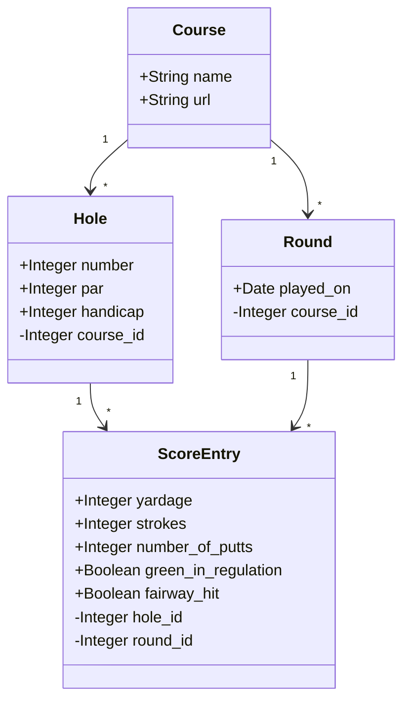

```mermaid
classDiagram
  class Hole
  Hole : +Integer number
  Hole : +Integer par
  Hole : +Integer handicap
  Hole : -Integer course_id

  class Course
  Course : +String name
  Course : +String url

  class Round
  Round : +Date played_on
  Round : -Integer course_id


  class ScoreEntry
  ScoreEntry : +Integer yardage
  ScoreEntry : +Integer strokes
  ScoreEntry : +Integer number_of_putts
  ScoreEntry : +Boolean green_in_regulation
  ScoreEntry : +Boolean fairway_hit
  ScoreEntry : -Integer hole_id
  ScoreEntry : -Integer round_id


  Course "1" --> "*" Hole
  Hole "1" --> "*" ScoreEntry
  Round "1" --> "*" ScoreEntry
  Course "1" --> "*" Round
```
