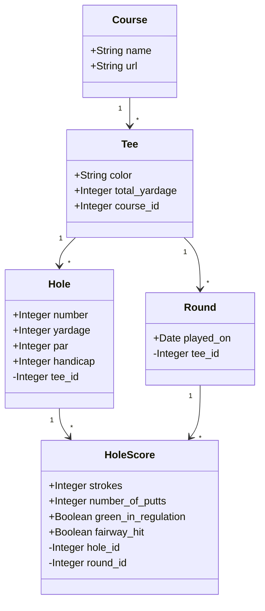

```mermaid
classDiagram
  class Hole
  Hole : +Integer number
  Hole : +Integer yardage
  Hole : +Integer par
  Hole : +Integer handicap
  Hole : -Integer tee_id

  class Course
  Course : +String name
  Course : +String url

  class Tee
  Tee : +String color
  Tee : +Integer total_yardage
  Tee : +Integer course_id

  class Round
  Round : +Date played_on
  Round : -Integer tee_id

  class HoleScore
  HoleScore : +Integer strokes
  HoleScore : +Integer number_of_putts
  HoleScore : +Boolean green_in_regulation
  HoleScore : +Boolean fairway_hit
  HoleScore : -Integer hole_id
  HoleScore : -Integer round_id

  Course "1" --> "*" Tee
  Tee "1" --> "*" Hole
  Hole "1" --> "*" HoleScore
  Round "1" --> "*" HoleScore
  Tee "1" --> "*" Round
```
